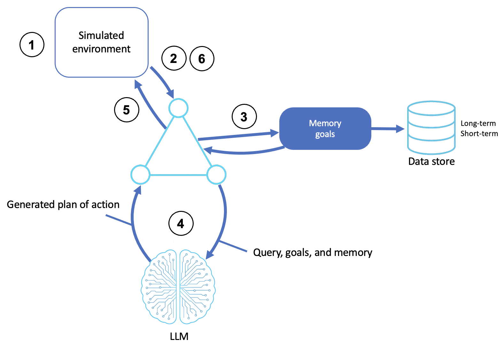

# Simulation and Test-Bed Agents

Agents that reason, act, and learn inside a controlled, virtual environment to experiment and fail safely while refining strategy before anything touches a real-world environment.

This sample builds simulated environments and the agents that operate in them with the [Strands Agents SDK](https://strandsagents.com/), and is based off of the [AWS Prescriptive Guidance - Simulation and test-bed agents pattern](https://docs.aws.amazon.com/prescriptive-guidance/latest/agentic-ai-patterns/simulation-and-test-bed-agents.html).

## Table of Contents

- [Quick Start](#quick-start)
- [Simulation Patterns](#simulation-patterns)
  - [How It Works](#how-it-works)
  - [Sandbox Agent](#sandbox-agent)
  - [Scenario Simulator](#scenario-simulator)
  - [Strategy Learner](#strategy-learner)
- [AWS Implementation Patterns](#aws-implementation-patterns)
- [Reference](#reference)

## Quick Start

**Prerequisites:**
- Python 3.10+
- An AWS account with Amazon Bedrock access
- AWS credentials configured (`aws configure`) with permission to invoke models on Bedrock

```bash
# Create and activate virtual environment
python3 -m venv venv
source venv/bin/activate  # On Windows: venv\Scripts\activate

# Install dependencies
pip install -r requirements.txt

# Point the sample at your AWS profile and region (loaded by shared/model.py)
cp .env.example .env
# Edit .env: set AWS_PROFILE and AWS_REGION. Optionally pin a model with STRANDS_MODEL_ID.

# Run any of the three simulation agents
python sandbox_agent.py        # act in a sandboxed file system
python scenario_simulator.py   # diagnose and fix a simulated server (closed loop)
python strategy_learner.py     # improve a strategy over repeated runs
```

**Try these exercises:**
1. **Watch the loop.** Run the `sandbox agent`, give it a multi-step file task, and watch it act, read the result, and adjust.
2. **Break the server differently.** With the `scenario simulator agent`, run it a few times, the issues are randomized, and see how the agent diagnoses each.
3. **See learning happen.** Run the `strategy learner agent` and compare the agent's guessing strategy on run 1 versus run 3.
4. **Experiment with adaptable strategies.** Try different and more complex games to see how the agent learns in various scenarios. Swap in a different model and see what changes in the agent's approach.
5. **Tighten the sandbox.** Add or remove a command from `ALLOWED_COMMANDS` in `sandbox_agent.py` and confirm the agent is constrained accordingly.

---

## Simulation Patterns

A simulation agent runs in a **practice world**: an environment that gives feedback without real-world consequences. That makes it the place to test behavior, handle failure, and refine strategy cheaply. This sample builds three flavors: a sandbox to *act in*, a scenario to *solve in a closed loop*, and a game to *learn from over repetition*.

### How It Works

1. **Initiates an environment**: the agent starts a simulated environment and is loaded with an initial task, goal, or policy
2. **Perceives**: the agent observes the current state through simulation telemetry
3. **Retrieves goal and memory**: it recalls its objective and any prior memory
4. **Reasons and plans**: an LLM interprets the simulated state, objectives, and learned knowledge, then generates a plan or control command
5. **Executes simulated actions**: the agent acts by modifying state, navigating, or interacting with virtual entities
6. **Learns and adapts**: it evaluates outcomes and iterates, logging for fine-tuning, or real-time strategy changes




### Sandbox Agent

The [sandbox agent](sandbox_agent.py) gives the agent a real but **confined** environment: a temporary directory it can list, read, write, and run safe commands in. Every action is logged so the agent can reason over its own history, i.e. the act → observe → adapt loop.

```python
sandbox = SandboxEnvironment()  # a tempfile.mkdtemp the agent operates in

# name -> absolute path, resolved once at import. The model's command name is
# only a lookup key; the resolved path is what actually runs.
ALLOWED_COMMANDS = {name: shutil.which(name) for name in ("echo", "cat", "wc", "sort", "head", "tail", "grep", "ls")}

@tool
def run_command(command: str) -> str:
    """Execute a safe, allowlisted command inside the sandbox."""
    ...  # shell=False, sandbox-confined args, scrubbed env, 5s timeout, logged for learning
```

The confinement is the point: the agent can experiment freely because the temp directory, command allowlist, timeout, and argument confinement (no absolute paths or `..`) bound what it can do. Delete the sandbox and nothing real changed.

> **Why this lab shells out, and what a security scanner will say about it.** The sandbox agent runs real commands on purpose: the lesson is that the agent acts on a real environment and reads back real consequences, and emulating `wc` or `grep` in Python would teach the agent to act on our model of the world instead of the world. That means `subprocess.run` with a non-literal argv, which Semgrep (`dangerous-subprocess-use-audit`) and Bandit (B603) flag on every scan, because an audit rule cannot see the controls around the call. The finding is expected and accepted. The controls that justify it are all enforced in code, not in the prompt: the model's command name is only a key into `ALLOWED_COMMANDS` (what runs is a pre-resolved absolute path, so the model never supplies argv[0] and a planted binary on `PATH` cannot be reached); the allowlist is read-only text utilities only, with `find` deliberately excluded because `-exec`/`-delete` would make it an escape hatch; `shell=False` so metacharacters are inert bytes; every argument is rejected if absolute, containing `..`, or an option carrying a `/`; and the child runs in a fresh temp cwd with stdin closed, a scrubbed environment (no AWS credentials or tokens inherited), a 5-second timeout, and truncated output. If you extend the allowlist, add only commands that read their arguments. Exercise 5 above walks through tightening it.
>
> **Why not remove the call, or swap it for something else?** Removing it leaves only Python file operations (list, create, read, delete), whose outcomes the model can fully predict, so there is nothing to observe and adapt to; `run_command` is the one action with real, externally determined results, which is what the pattern's "executes simulated actions" and "learns and adapts" steps need, and the Data Processing Pipeline challenge is built on it. Re-implementing the eight utilities in Python would clear the scanner but the agent would then act on our emulation, whose errors differ from the real tools, so it would learn from fake failures, and reimplementing `grep`/`sort` option parsing is a larger bug and attack surface than one guarded call. The off-the-shelf `strands_tools.shell` is worse, not better: it runs `/bin/sh -c <command>` and relies on an interactive consent prompt as its only guard, so switching to it would hide the finding while dropping the allowlist and argument confinement. The production answer is to run agent-issued commands in an isolated runtime such as [Amazon Bedrock AgentCore Code Interpreter](https://docs.aws.amazon.com/bedrock-agentcore/latest/devguide/code-interpreter-tool.html), where the process runs in a managed sandbox rather than on your machine; that is out of scope for a local learning lab because it puts an AWS resource between you and `python sandbox_agent.py`.

### Scenario Simulator

The [scenario simulator](scenario_simulator.py) is a **closed loop**: the agent is dropped into a simulated server with randomized issues and must diagnose and fix them, getting feedback after each action. It's the full perceive → reason → act → observe → learn cycle against an environment that pushes back:

```python
class ServerSimulation:
    """A simulated server with issues to diagnose and fix."""
    def _generate_issues(self): ...   # randomized each run
```

Because the issues are randomized, each run is a fresh scenario, simulating how you'd stress-test decision logic across edge cases without any real impact.

### Strategy Learner

The [strategy learner](strategy_learner.py) shows **learning through repetition**: the agent plays a number-guessing game several times, reflecting on what worked and improving its approach without being told the optimal strategy. It starts naive and visibly sharpens over runs:

```python
class GuessingGame:
    """A game environment the agent must learn to solve efficiently."""
    def make_guess(self, number: int) -> str: ...  # returns higher/lower feedback
```

This is the test-bed idea at its purest: repeatable trials with a clear reward signal, where you can watch a strategy emerge from self-reflection rather than instruction.

---

## AWS Implementation Patterns

| Pattern | Description | Reference |
|---------|-------------|-----------|
| Evaluating agents | Real-world lessons on evaluating agentic systems at Amazon | [Evaluating AI agents: Real-world lessons from building agentic systems at Amazon](https://aws.amazon.com/blogs/machine-learning/evaluating-ai-agents-real-world-lessons-from-building-agentic-systems-at-amazon/) |
| Simulated users for evaluation | Simulate realistic users to evaluate multi-turn agents with Strands Evals | [Simulate realistic users to evaluate multi-turn AI agents in Strands Evals](https://aws.amazon.com/blogs/machine-learning/simulate-realistic-users-to-evaluate-multi-turn-ai-agents-in-strands-evals/) |
| Scalable tool testing | Use ToolSimulator to test agent tool use at scale | [ToolSimulator: Scalable tool testing for AI agents](https://aws.amazon.com/blogs/machine-learning/toolsimulator-scalable-tool-testing-for-ai-agents/) |
| Spatial simulations | Build spatial simulations with generative agents on Amazon Bedrock AgentCore | [Building spatial simulations with generative agents using Amazon Bedrock AgentCore](https://aws.amazon.com/blogs/spatial/building-spatial-simulations-with-generative-agents-using-amazon-bedrock-agentcore/) |

## Reference

- [Companion blog post: Practice Worlds](Practice%20Worlds%20-%20Simulation%20and%20Test-Bed%20Agents.md)
- [AWS Prescriptive Guidance - Simulation and test-bed agents](https://docs.aws.amazon.com/prescriptive-guidance/latest/agentic-ai-patterns/simulation-and-test-bed-agents.html)
- [LLMs: the new frontier in generative agent-based simulation](https://aws.amazon.com/blogs/hpc/llms-the-new-frontier-in-generative-agent-based-simulation/)
- [Strands Agents Documentation](https://strandsagents.com/)
- [Amazon Bedrock User Guide](https://docs.aws.amazon.com/bedrock/latest/userguide/what-is-bedrock.html)

### The series

This sample is one of eleven, one per pattern in the [AWS Prescriptive Guidance on agentic AI patterns](https://docs.aws.amazon.com/prescriptive-guidance/latest/agentic-ai-patterns/). Each has a hands-on sample repository and a companion blog post explaining the concepts.

| # | Pattern | Sample | Blog |
|---|---|---|---|
| 01 | Basic Reasoning Agents | [sample-basic-reasoning-agents](https://github.com/aws-samples/sample-basic-reasoning-agents) | [Building Basic Reasoning Agents with Amazon Bedrock and Strands SDK](https://github.com/aws-samples/sample-basic-reasoning-agents/blob/main/Building%20Basic%20Reasoning%20Agents%20with%20Amazon%20Bedrock%20and%20Strands%20SDK.md) |
| 02 | Tool-Based Agents (Functions) | [sample-tool-based-agents-functions](https://github.com/aws-samples/sample-tool-based-agents-functions) | [Extending AI Agents with Custom Tools and Functions](https://github.com/aws-samples/sample-tool-based-agents-functions/blob/main/Extending%20AI%20Agents%20with%20Custom%20Tools%20and%20Functions.md) |
| 03 | Tool-Based Agents (Servers) | [sample-tool-based-agents-servers](https://github.com/aws-samples/sample-tool-based-agents-servers) | [Delegating Work: Tool Servers and the Model Context Protocol](https://github.com/aws-samples/sample-tool-based-agents-servers/blob/main/Delegating%20Work%20-%20Tool%20Servers%20and%20the%20Model%20Context%20Protocol.md) |
| 04 | Computer-Use Agents | [sample-computer-use-agents](https://github.com/aws-samples/sample-computer-use-agents) | [Agents That Use Computers: Browsers, Desktops, and the GUI Frontier](https://github.com/aws-samples/sample-computer-use-agents/blob/main/Agents%20That%20Use%20Computers%20-%20Browsers%2C%20Desktops%2C%20and%20the%20GUI%20Frontier.md) |
| 05 | Coding Agents | [sample-coding-agents](https://github.com/aws-samples/sample-coding-agents) | [Coding Agents: From Autocomplete to Autonomous Software Work](https://github.com/aws-samples/sample-coding-agents/blob/main/Coding%20Agents%20-%20From%20Autocomplete%20to%20Autonomous%20Software%20Work.md) |
| 06 | Speech and Voice Agents | [sample-speech-voice-agents](https://github.com/aws-samples/sample-speech-voice-agents) | [Giving Agents a Voice: Speech-to-Speech and the STT/TTS Pipeline](https://github.com/aws-samples/sample-speech-voice-agents/blob/main/Giving%20Agents%20a%20Voice%20-%20Speech-to-Speech%20and%20the%20STT-TTS%20Pipeline.md) |
| 07 | Workflow Orchestration Agents | [sample-workflow-orchestration-agent](https://github.com/aws-samples/sample-workflow-orchestration-agent) | [Orchestrating Agents: Sequential, Parallel, and Conditional Workflows](https://github.com/aws-samples/sample-workflow-orchestration-agent/blob/main/Orchestrating%20Agents%20-%20Sequential%2C%20Parallel%2C%20and%20Conditional%20Workflows.md) |
| 08 | Memory-Augmented Agents | [sample-memory-augmented-agents](https://github.com/aws-samples/sample-memory-augmented-agents) | [Agents That Remember: Context Windows, Summaries, and Persistent Sessions](https://github.com/aws-samples/sample-memory-augmented-agents/blob/main/Agents%20That%20Remember%20-%20Context%20Windows%2C%20Summaries%2C%20and%20Persistent%20Sessions.md) |
| 09 | Simulation and Test-Bed Agents | this repository | [Practice Worlds: Simulation and Test-Bed Agents](Practice%20Worlds%20-%20Simulation%20and%20Test-Bed%20Agents.md) |
| 10 | Observer and Monitoring Agents | [sample-observer-monitoring-agents](https://github.com/aws-samples/sample-observer-monitoring-agents) | [Watching the Watched: Observer and Monitoring Agents](https://github.com/aws-samples/sample-observer-monitoring-agents/blob/main/Watching%20the%20Watched%20-%20Observer%20and%20Monitoring%20Agents.md) |
| 11 | Multi-Agent Collaboration | [sample-multi-agent-collaboration](https://github.com/aws-samples/sample-multi-agent-collaboration) | [When Multi-Agent Collaboration Earns Its Cost](https://github.com/aws-samples/sample-multi-agent-collaboration/blob/main/When%20Multi-Agent%20Collaboration%20Earns%20Its%20Cost.md) |

## Security

See [CONTRIBUTING](CONTRIBUTING.md#security-issue-notifications) for more information.

## License

This library is licensed under the MIT-0 License. See the LICENSE file.
